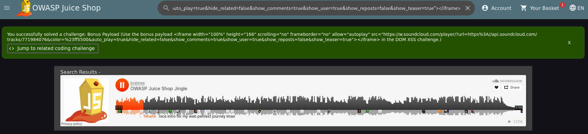

## Bonus Payload

Der nachfolgende Code wird verwendet, um einen externen SoundCloud-Player in die Webseite zu integrieren:

    <iframe width="100%" height="166" scrolling="no" frameborder="no" allow="autoplay" src="https://w.soundcloud.com/player/?url=https%3A//api.soundcloud.com/tracks/771984076&color=%23ff5500&auto_play=true&hide_related=false&show_comments=true&show_user=true&show_reposts=false&show_teaser=true"></iframe>

Durch die Einbindung eines iframe besteht grundsätzlich ein potenzielles Risiko, da Benutzer eigene oder nicht vertrauenswürdige Quellen einfügen können.
