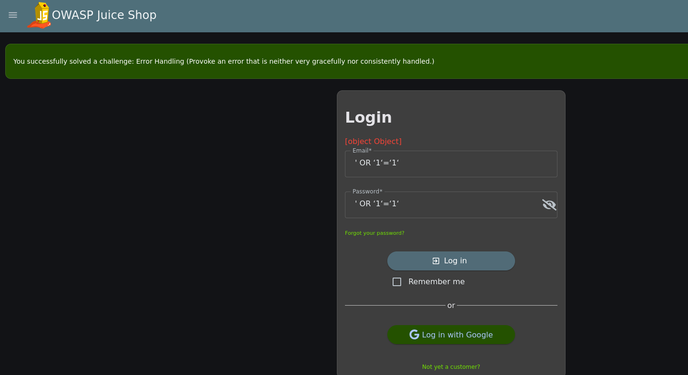

## Error-Handling

Auf der Loginseite des Juice Shops erscheint bei einer fehlerhaften Eingabe folgendes:

Die Anwendung behandelt Fehler somit nicht sauber und interne Fehlerobjekte gelangen an die Benutzeroberfläche.
