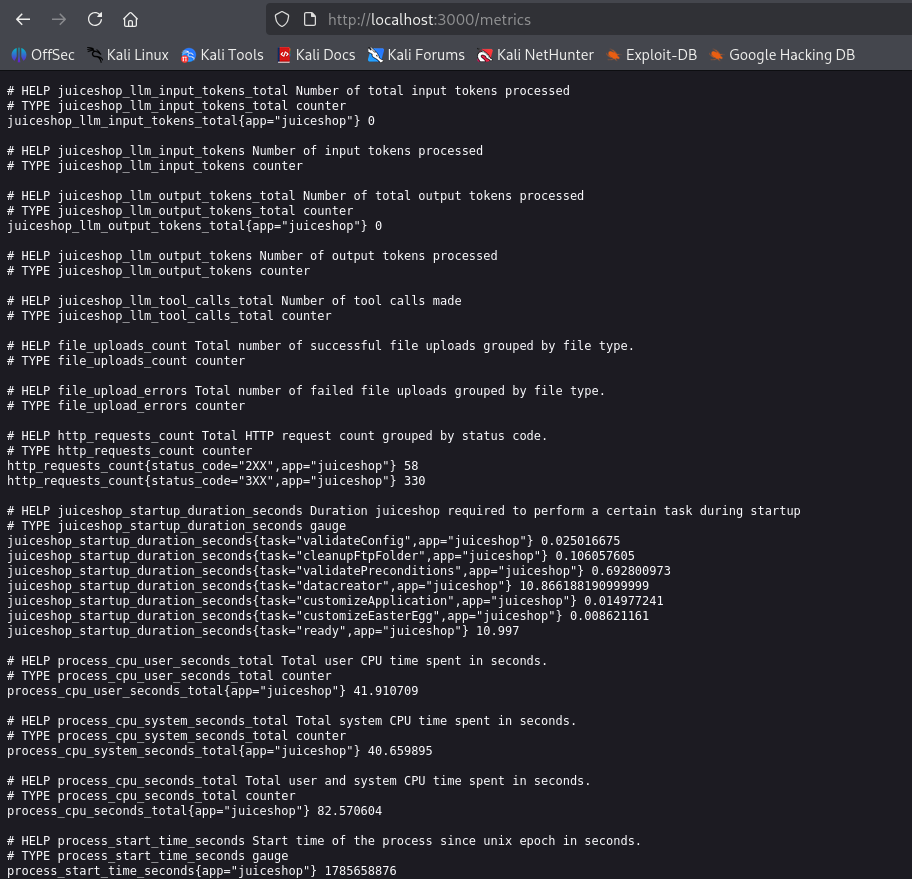

## Exposed Metrics

Um den versteckten Monitoring-Endpunkt zu finden, wurde die Standardkonfiguration von Prometheus überprüft. Prometheus verwendet werksseitig den Pfad /metrics, um Messdaten von Anwendungen abzurufen.

Durch Aufrufen von:

    http://localhost:3000/metrics

Erscheint eine Seite mit internen Informationen über die Anwendung, darunter Prozessinformationen wie CPU-Auslastung oder Speicherverbrauch:

