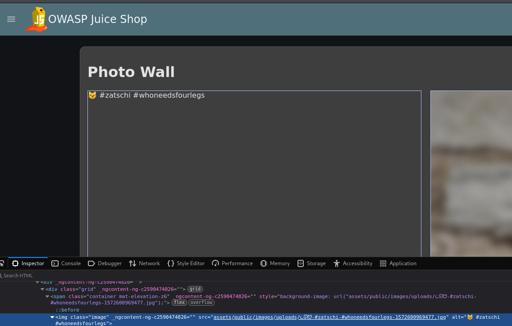
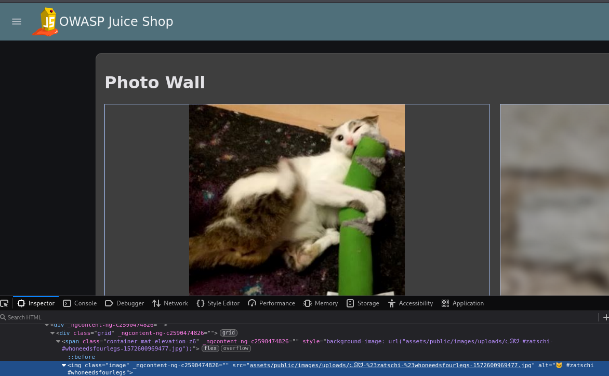

## Missing Encoding

Für die Challenge im Juice Shop anmelden und zur Photo Wall navigieren. Auf dieser erscheint ganz oben links nur ein Icon von einer Katze, während das zugehörige Bild nicht angezeigt wird.
Um das Problem genauer zu untersuchen, per Rechtsklick den Inspector öffnen und den Seitenquelltext überprüfen. Dort findet sich der Link zum fehlenden Bild in folgender Form:

Da die URL ungültige bzw. speziell reservierte Zeichen enthält, müssen diese entweder mit einem URL-Encoder encodiert oder manuell in ihre entsprechende Percent-Encoding-Darstellung umgewandelt werden.
Durch die Percing-Encoding Tabelle https://developer.mozilla.org/en-US/docs/Glossary/Percent-encoding lässt sich feststellen, dass das Zeichen # durch %23 ersetzt werden muss.

