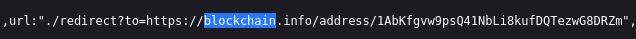
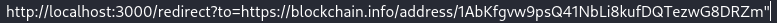
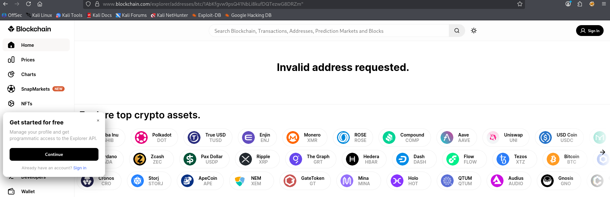

## Outdated Allowlist

Auf der Homepage die Entwicklerwerkzeuge öffnen und nach JavaScript-Dateien suchen:

Die entsprechende js-Seite aufrufen und den Quellcode anzeigen lassen:

In dem Quellcode nach redirect oder blockchain suchen:

Den Endpunkt an die Juice-Shop-Homepage anfügen:

Die entsprechende Seite aufrufen:

