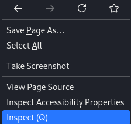
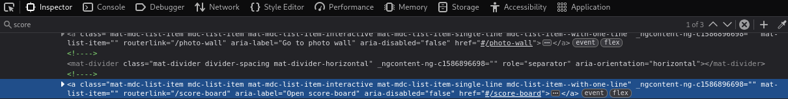

## Score-Board

Auf der Startseite des Juice Shops mit einem Rechtsklick das Menü öffnen und „Inspect (Q)“ auswählen.

Anschließend im Inspector nach "score" suchen:

Bei der Suche erscheint href="#/score-board". 

Durch die Eingabe von `http://localhost:3000/#score-board` erscheint das Score-Board.

