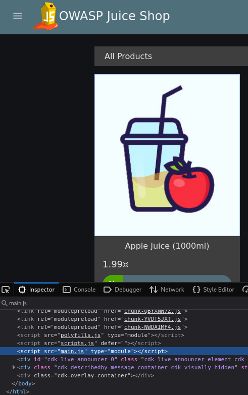
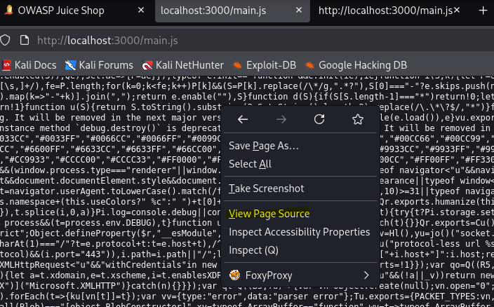
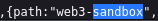
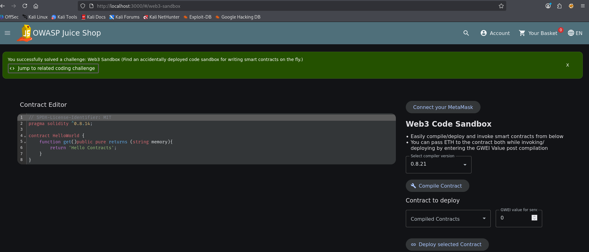

## Web3 Sandbox

Auf der Homepage die Entwicklerwerkzeuge öffnen und nach JavaScript-Dateien suchen:

Die entsprechende js-Seite aufrufen und den Quellcode anzeigen lassen:

Dann in dem Quellcode nach sandbox oder web3 suchen:

Zum Schluss den Endpunkt an die Homepage anfügen:

