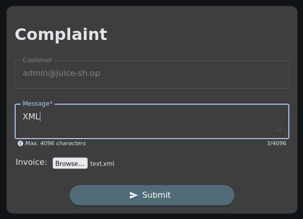

## Deprecated interface

Die Anwendung verwendet für den Upload eine veraltete B2B-Schnittstelle, die eigentlich nicht mehr verwendet werden sollte. Diese ermöglicht das Hochladen von XML-Dateien. Dazu im Juice Shop anmelden und anschließend zum Bereich „Compliant“ navigieren. Auf dieser Seite kann eine XML-Datei hochgeladen werden.

