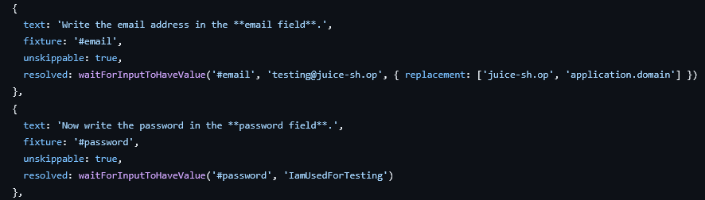
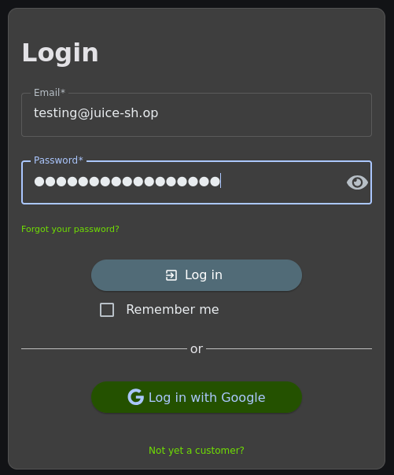

## Exposed credentials

Im Quellcode vom Juice Shop nach Credentials suchen. Dabei erscheint eine Seite in der die benötigten Daten stehen.

Die Anmeldedaten mit `testing@juice-sh.op` und `IamUsedForTesting` eingeben.

