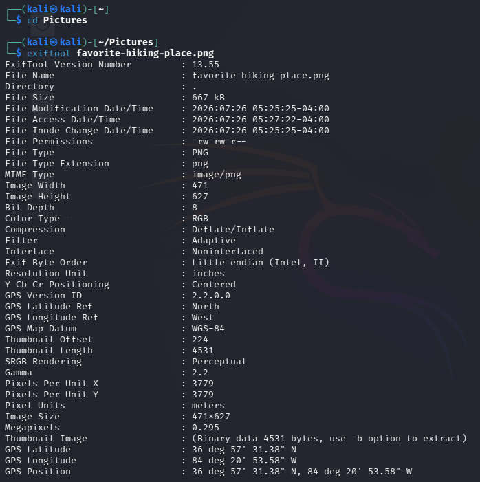
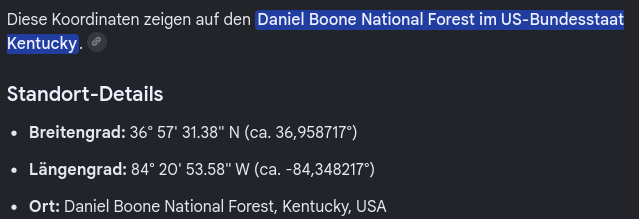
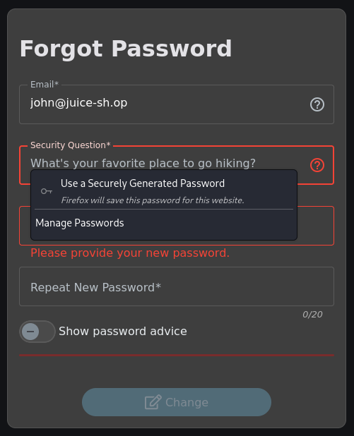

## Meta Geo Stalking
Auf der Photowall das Bild von John herunterladen und mit Exiftool die Metadaten auslesen:

Anschließend die GPS-Position kopieren und googeln:

Zum Schluss über Account das Passwort mithilfe der Sicherheitsfrage "What's your favorite place to go hiking?" zurücksetzen:

