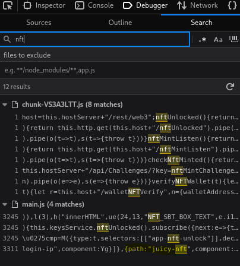
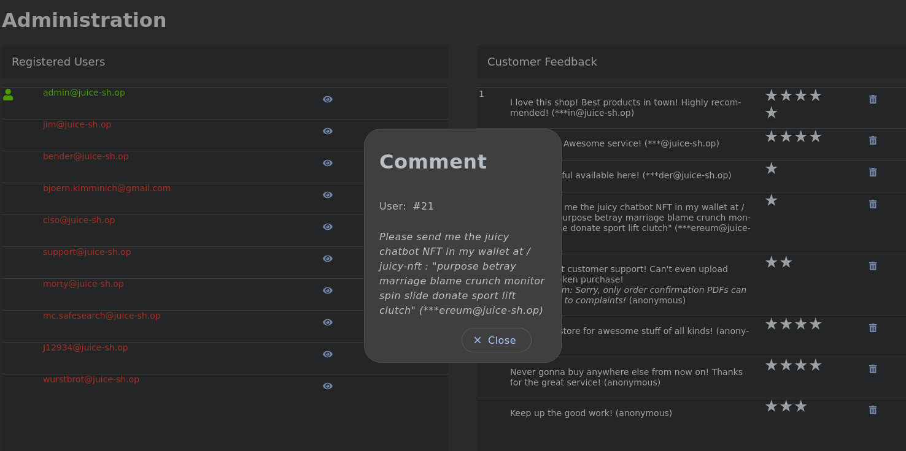
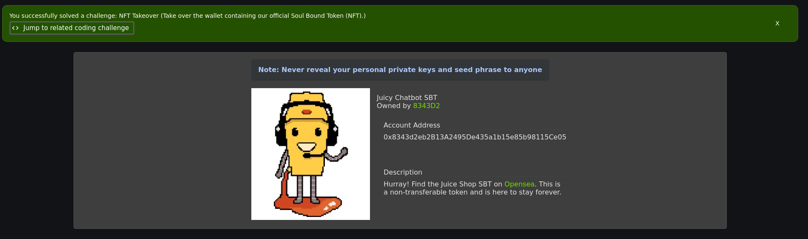

## NFT Takeover

Auf der Startseite des Juice Shops mit einem Rechtsklick das Menü öffnen und anschließend „Inspect (Q)“ auswählen. Dann in der main.js Datei nach NFT suchen, wobei der Pfad juicy-nft gefunden wird, über den die entsprechende Unterseite der Challenge aufgerufen werden kann.

Über den Admin-Account können die abgegebenen Benutzerbewertungen eingesehen werden. In einer dieser Bewertungen befindet sich eine Mnemonic-Phrase.

Mithilfe eines geeigneten Mnemonic-/Ethereum-Konverters lässt sich die Phrase in die zugehörigen Wallet-Daten umwandeln. Dadurch kann auf die Wallet zugegriffen und der darin enthaltene Soul Bound Token (NFT) identifiziert werden. 

