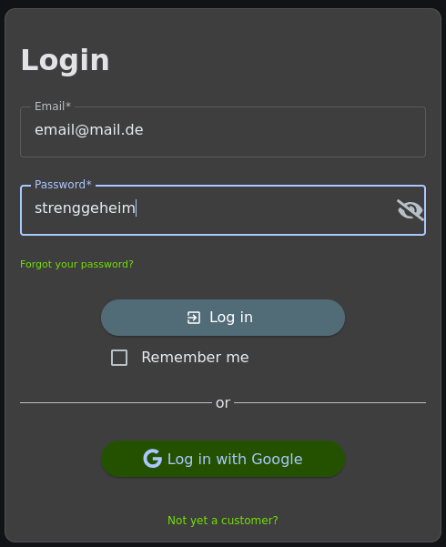
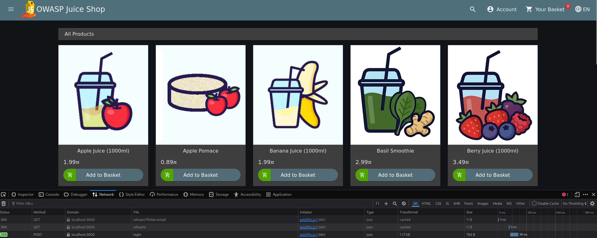
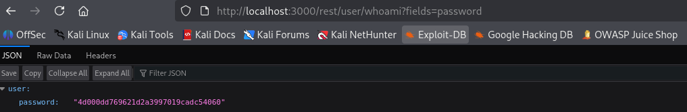

## Password Hash Leak 

Mit einem Konto anmelden und währenddessen im Browser-Inspector den Netzwerkverkehr überwachen. 

Dabei fällt auf, dass der Endpunkt `whoami?fields=email` existiert. 

Anschließend prüfen, ob sich diese Information in Verbindung mit dem Parameter `password` verwenden lässt.

