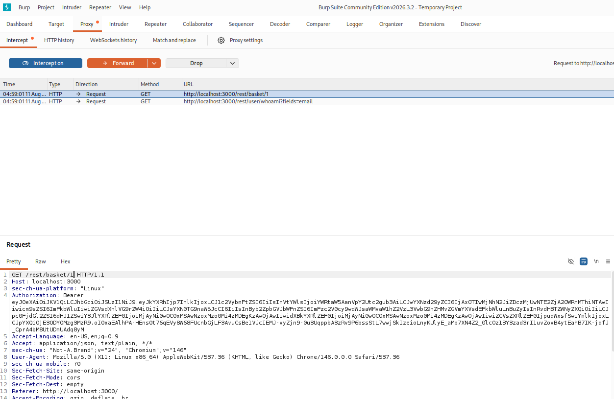
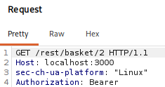
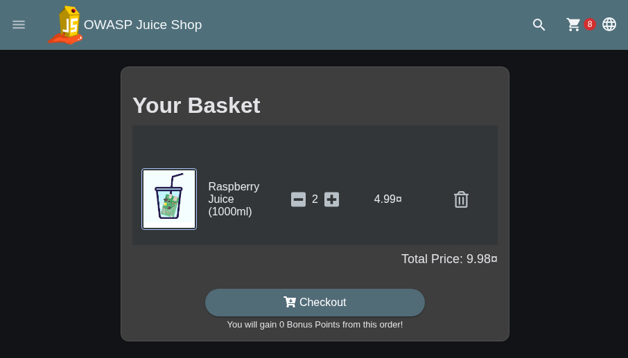

## View basket

Zunächst im Juice Shop beliebige Waren zum Warenkorb hinzufügen. Anschließend Burp Suite öffnen und Interception aktivieren. Danach im Juice Shop zum Warenkorb navigieren. In Burp Suite lässt sich nun der entsprechende Request untersuchen. Dabei fällt auf, dass sich hinter dem Pfad `/rest/basket/` eine ID befindet, in dem Fall die 1.

Diese ID kann im Request von `1` auf `2` geändert werden. Anschließend den manipulierten Request weiterleiten. 

Dadurch wird auf den Warenkorb mit der entsprechenden ID zugegriffen.

